# Deploying into IBM Cloud Private using Helm

As there are not many helpful tutorials out there on how to deploy a cloud native application, I aim to detail how you can deploy a native app that runs on IBM Cloud Private.

In short, how to create a Helm release that runs a dockerised application within the IBM Cloud Private like such:

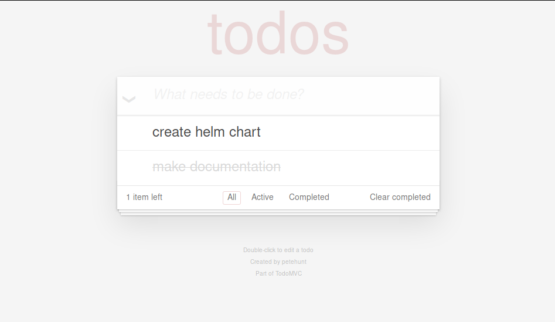

## ICP Setup

This guide assumes that you have already installed IBM Cloud Private into your computer, preferably with [Vagrant](https://github.com/IBM/deploy-ibm-cloud-private/blob/master/docs/deploy-vagrant.md) (it should, but has not been tested to, work with other setup methods).

If you have not done so yet, you can follow this document [here](https://github.com/Samleo8/mongo-icp-test#database-setup).

## Helm Setup

The IBM Cloud Private uses [Helm](https://helm.sh/) as its kubernetes package manager.

Please follow the setup instructions by IBM [here](https://www.ibm.com/support/knowledgecenter/en/SSBS6K_3.2.0/app_center/create_helm_cli.html) for full setup instructions.

### Install Helm
Check if Helm already installed. Inside your master node (`vagrant ssh` if using Vagrant), type `helm version --tls`.

*Note: If you used the aforementioned Vagrant setup, helm should already be automatically installed in your **master node** (i.e. the node which you `vagrant ssh` into).*

If you see something like:
```
Client: &version.Version{SemVer:"v2.9.1", GitCommit:"20adb27c7c5868466912eebdf6664e7390ebe710", GitTreeState:"clean"}
Server: &version.Version{SemVer:"v2.9.1+icp", GitCommit:"8ddf4db6a545dc609539ad8171400f6869c61d8d", GitTreeState:"clean"}
```
then Helm is succesfully installed and you can move on to the next step.

However, if you get an error stating that *helm: command not found*, then you need to install helm according to IBM's instructions [here](https://www.ibm.com/support/knowledgecenter/en/SSBS6K_3.2.0/app_center/create_helm_cli.html#install_helm)

**NOTE:** Do not run `helm --upgrade` as according to IBM, this will "replaces the server version of Helm Tiller that is installed with IBM Cloud Private"

### Initialising Helm

We now need to configure Helm properly.

Use IBM's documentation [here](https://www.ibm.com/support/knowledgecenter/en/SSBS6K_3.2.0/app_center/create_helm_cli.html#verify_helm) to configure Helm.

You can also run the included script in `scripts/helm_config.sh`, which
1. Export the `HELM_HOME` variable
	```
	export HELM_HOME="~/.helm"
	```

2. Logs into the cloud via `cloudctl` *(not in IBM instructions)*
	```
	cloudctl login -n default -u admin -p $PASSWORD -a https://$SERVER:8443 --skip-ssl-validation`)
	```

3. Initiliases helm
	```
	helm init --tls --client-only
	```

	**DO NOT** run with `--upgrade` flag if prompted. IBM Cloud Private uses an old Tiller version.

4. Replaces the default `stable` repository by Kubernetes with IBM's. This is a bug fix for when you are installing IBM's Helm releases using the [command line](https://github.com/Samleo8/mongo-icp-test#command-line). Also adds local chart repostitory *(not in IBM instructions)*.

	```
	helm repo add stable https://raw.githubusercontent.com/IBM/charts/master/repo/stable
	helm repo add local-charts https://$SERVER:8443/helm-repo/charts --ca-file $HELM_HOME/ca.pem --cert-file $HELM_HOME/cert.pem --key-file $HELM_HOME/key.pem
	```

5. Updates and lists repositories

	```
	helm repo update
	helm repo list
	```

## Creating the Application

Now that Helm has been properly set up, we need to actually create the full application.

For the purposes of this tutorial, we will be using an existing Docker application, a [simple to-do list](https://github.com/prydonius/todomvc/tree/master/examples/react) found on [Docker Hub](https://hub.docker.com/r/prydonius/todo/).  

If you would like to create your own Docker application, see [this tutorial by Docker](https://docs.docker.com/get-started/) for details.

### Creating the Helm Release

The application in question is actually a Helm release that runs docker images. The full tutorial with specific details are in [this tutorial](https://docs.bitnami.com/kubernetes/how-to/create-your-first-helm-chart/).

To create the Helm release,
1. Enter into your master node. If you are using Vagrant, `vagrant ssh` in.

2. **[Initiliase helm](#initialising-helm)** using the script in `scripts/helm_config.sh`

3. Navigate (`cd`) to the folder in your master node where you would like to create such a helm release.

4. **Create the helm chart**
	```
	helm create <chart_name>
	```

	For example, `helm create todolist`

5. A folder will be created in the current directory with the chart name specified in the above command (`todolist` in this case). Navigate to that directory and list its contents using `cd <chart_name> && ls`.

	You should see something like this:

	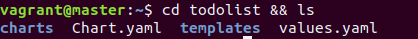

6. **Edit the `values.yaml` file**

	You should see a file named `values.yaml`. This is the file where you will change the parameters of the Helm release, including the docker image that it uses, the service type etc.

	Open it with an editor (`vim`, `nano` or `gedit` for example).

	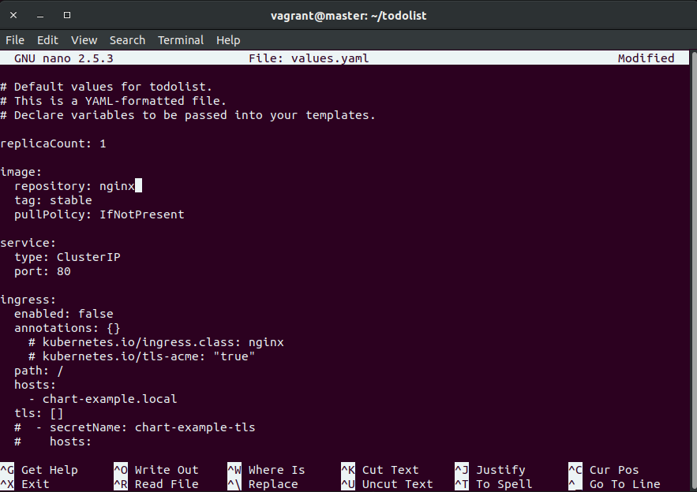

7. We will be using this [simple to-do list](https://github.com/prydonius/todomvc/tree/master/examples/react) for our docker image.

	It is listed on [Docker Hub](https://hub.docker.com/r/prydonius/todo/) as `prydonius/todo`. If you are using your own Docker image, you can use `<docker username of repo owner>/<docker repo name>` accordingly. See an example of that [below](#helm-release-with-your-own-gui-application).

	a. Change the default value of `image: 	repository:` (`ngnix` by default) to the docker repo, for example, `prydonius/todo`:

	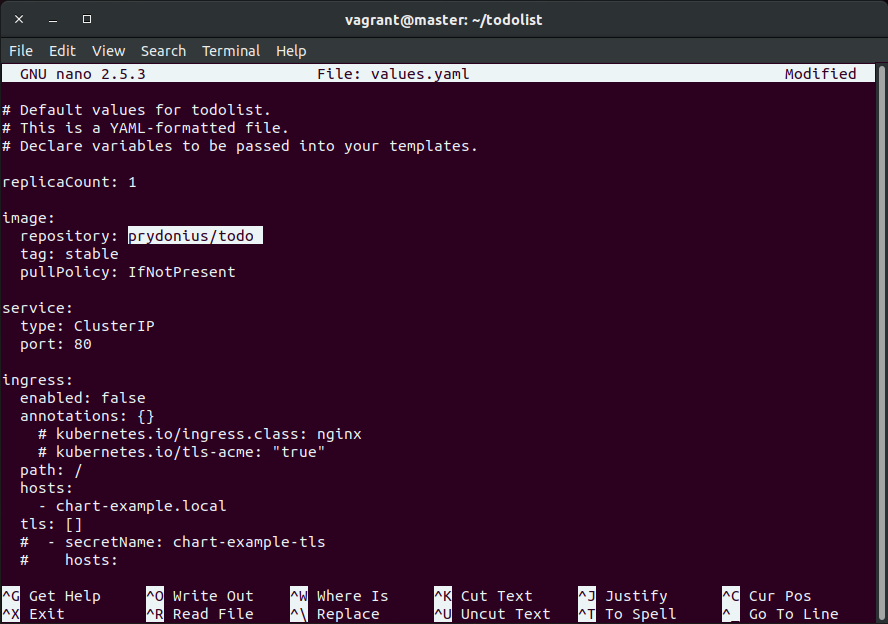

	b. Change the default value of `service: type:` from `ClusterIP` to `NodePort`.

	The `NodePort` type allows us to expose a port that allows us to access the application externally.

	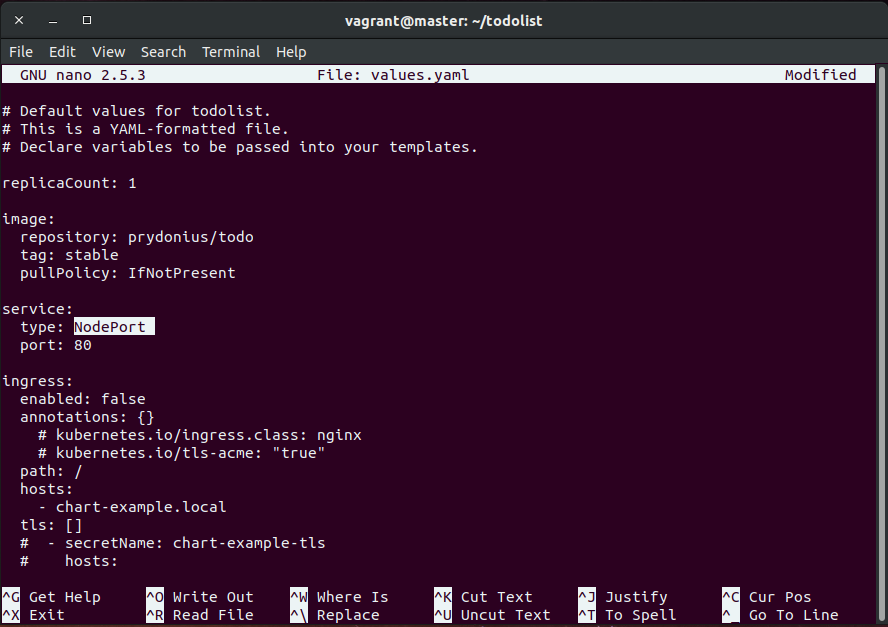

	c. Change the default value of `image: tag:` from stable to `1.0.0`.

	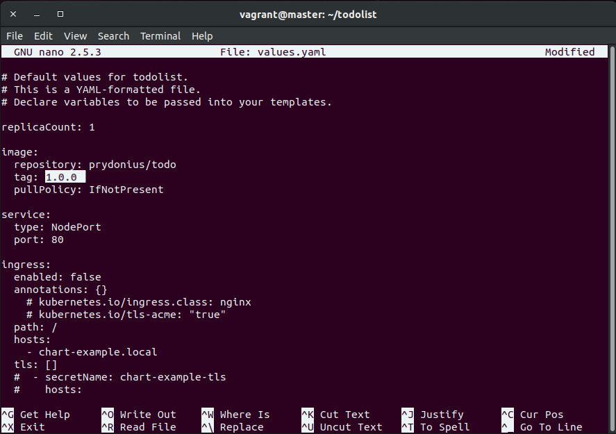

	Note that this may only apply for this particular docker repository.

	Save the file.

8. **Validate the `values.yaml` file**

	It is always good to validate your `values.yaml` file using `helm lint .` (command run inside the folder where the helm release is located)

	```bash
	$ helm lint .

	==> Linting .
	[INFO] Chart.yaml: icon is recommended

	1 chart(s) linted, no failures
	```

9. **Install the Helm Release**

	We can now install the helm release

	```
	helm install --tls --name <name_of_release> <folder_containing_helm release> [--set <options>]
	```

	For example,

	```
	helm install --tls --name todolist .
	```

	*Note: the `--tls` flag is very important, because otherwise you might get errors like `error: transport is closing`. This is probably due to a security implementation within the IBM Cloud Private server.*

10. **Checking your Installation**

	After running the above `helm install` command, and if the installation is successful, you will get an output as follows:

	```bash
	NAME:   todolist
	LAST DEPLOYED: Fri Jun 21 11:18:01 2019
	NAMESPACE: default
	STATUS: DEPLOYED

	RESOURCES:
	==> v1/Service
	NAME      TYPE      CLUSTER-IP  EXTERNAL-IP  PORT(S)       AGE
	todolist  NodePort  10.0.0.105  <none>       80:31056/TCP  1s

	==> v1beta2/Deployment
	NAME      DESIRED  CURRENT  UP-TO-DATE  AVAILABLE  AGE
	todolist  1        1        1           0          1s

	==> v1/Pod(related)
	NAME                       READY  STATUS             RESTARTS  AGE
	todolist-6cf8998b57-t2xvv  0/1    ContainerCreating  0         1s


	NOTES:
	1. Get the application URL by running these commands:
	  export NODE_PORT=$(kubectl get --namespace default -o jsonpath="{.spec.ports[0].nodePort}" services todolist)
	  export NODE_IP=$(kubectl get nodes --namespace default -o jsonpath="{.items[0].status.addresses[0].address}")
	  echo http://$NODE_IP:$NODE_PORT

	```

	Because the docker image is a todo list created using React and is meant to be run in a web browser, get the application URL by running the command (also stated in the above output):
	```bash
	export NODE_PORT=$(kubectl get --namespace default -o jsonpath="{.spec.ports[0].nodePort}" services todolist)
	export NODE_IP=$(kubectl get nodes --namespace default -o jsonpath="{.items[0].status.addresses[0].address}")
	echo http://$NODE_IP:$NODE_PORT
	```

	For example, my application can be seen at `http://192.168.31.100:31347`:

	

	You will also be able to see the Helm release under IBM Cloud's console, under **Workloads > Helm Releases**.

	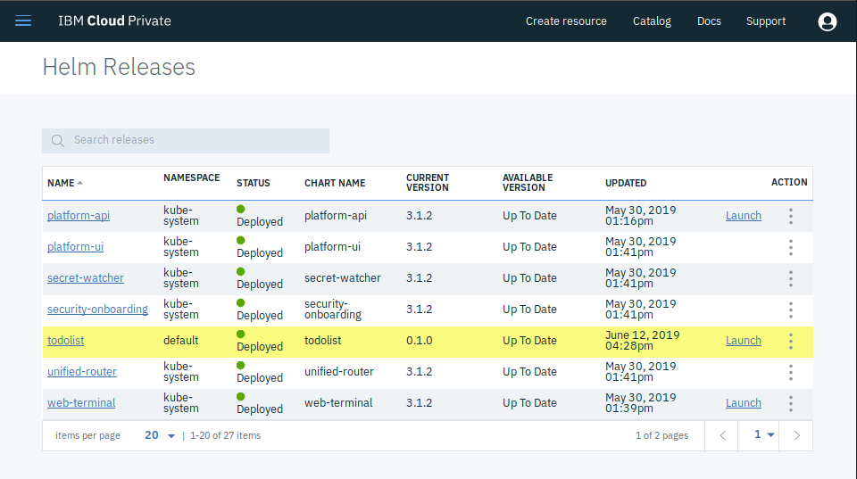

	*DEBUGGING:*
	If it is taking exceedingly long for the application to become "available", there might be an issue with the Internet connection. Try to `ping google.com` from within the master node, and troubleshoot accordingly. You might have to reboot using `vagrant reload` if you are using a Vagrant VM.

### Helm Release with your own GUI application
Because you are creating your own GUI application, you will naturally have more control over the way your application is setup. For instance, you might specify it's internal ports etc.

However, this also means that you will have to do extra configurations, which may not be well-documented, and as such I am to do that here.

I will be using my own Dockerised application [here](https://github.com/samleo8/pyflask-yolo) modified off [@gxercavins's repository](https://github.com/gxercavins/image-api). It is a Python Flask-based application that allows you to upload a photo and perform image processing to it.

Notably, I have modified [@gxercavins](https://github.com/gxercavins/)'s code so that instead of only doing flipping and cropping, it also allows you to apply the **[YOLO Object Detection & Classification (computer vision) algorithm](https://pjreddie.com/darknet/yolov2/)** on the given image. This allows us to showcase the full power of the cloud for more power-intensive computing.

I have also changed the `app.py` to use the host `0.0.0.0` so that the entry point can be accessed from outside the Docker container. I also (obviously) added a Dockerfile that runs `app.py` and exposes the GUI on port `5000`.

The instructions to create the helm release are the same as that as [above](#creating-the-helm-release), with changes below:
*(If you notice the screenshots having the name `pyimage-test`, that was the name of the old repository without the aforementioned YOLO implementation; just change it to `pyflask-yolo` accordingly)*

If you would like to use a local or offline Docker image/repository, refer to the guide [below](#helm-release-with-offline-docker-repo).

1. **Create the Helm Release**
Within the master node, create a Helm release
```
helm create <name_of_release>
```

For example, in this case we are using the name `pyflask-yolo` (you can name it however you like):
```
helm create pyflask-yolo
```

2. **Edit the `values.yaml` file**
This time we'll be using my repository hosted here on [Docker hub](https://hub.docker.com/r/samleo8/pyflask-yolo) at `samleo8/pyflask-yolo:latest`.

a. Change the default value of `image: 	repository:` (`ngnix` by default) to the docker repo `samleo8/pyflask-yolo`:

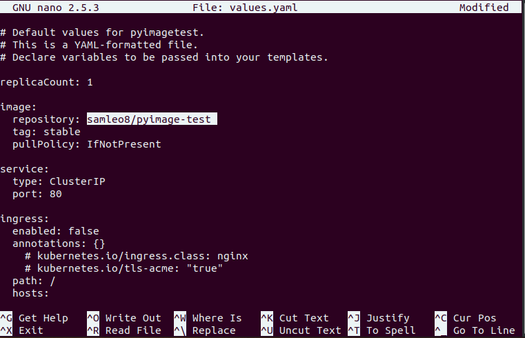

b. Change the default value of `service: type:` from `ClusterIP` to `NodePort`.

The `NodePort` type allows us to expose a port that allows us to access the application externally.

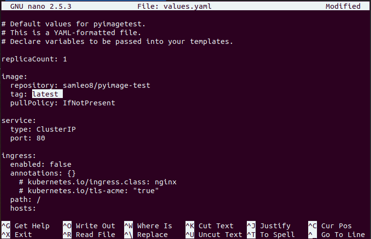

c. Change the default value of `image: tag:` from `stable` to `latest`.

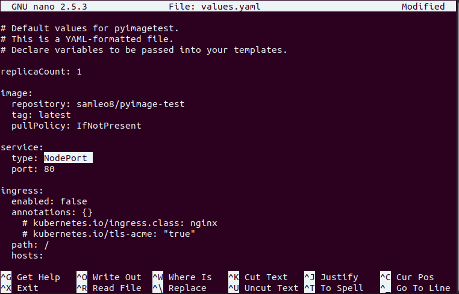

d. Under `service:`, add `internalPort: 5000`

This allows us to use an internal port `5000` in the container, which corresponds exactly to the port exposed in the Docker container.

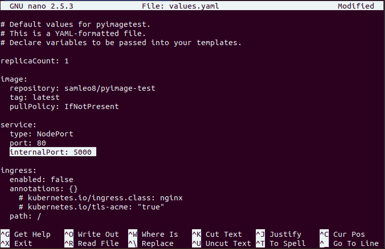

Save the file.

3. **Edit the `templates/deployment.yaml` file**
Because of the `internalPort` which we will need to use, we need to edit the `templates/deployment.yaml` file.

Under, `spec: template: spec: containers:`
```yaml
spec:
  containers:
    - name: {{ .Chart.Name }}
      image: "{{ .Values.image.repository }}:{{ .Values.image.tag }}"
      imagePullPolicy: {{ .Values.image.pullPolicy }}
      ports:
        - name: http
          containerPort: {{ .Values.service.internalPort }}
          protocol: TCP
      livenessProbe:
        httpGet:
          path: /
          port: {{ .Values.service.internalPort }}
      readinessProbe:
        httpGet:
          path: /
          port: {{ .Values.service.internalPort }}
```

Note that parts with `{{ .Values.service.internalPort }}` (they were originally `80`).

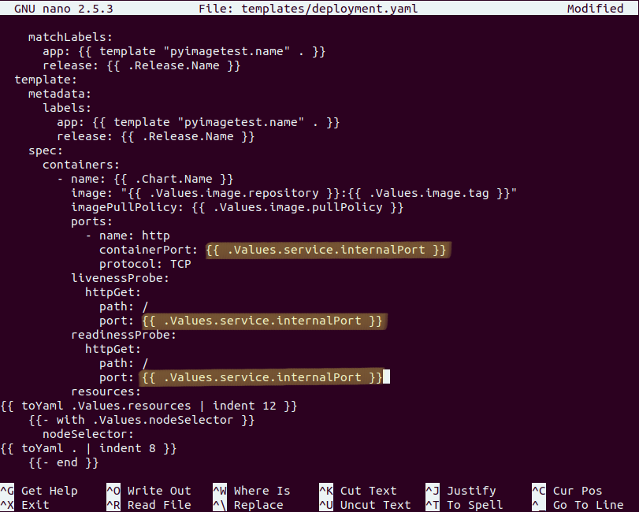

Save the file.

4. **Validate, Install and Launch**
	```bash
	$ helm lint .
	$ helm install --tls --pyflask-yolo .

	$ export NODE_PORT=$(kubectl get --namespace default -o jsonpath="{.spec.ports[0].nodePort}" services todolist)
	$ export NODE_IP=$(kubectl get nodes --namespace default -o jsonpath="{.items[0].status.addresses[0].address}")
	$ echo http://$NODE_IP:$NODE_PORT

	http://192.168.31.100:31347
	```

	*More information in the instructions [above, #8,9,10](#creating-the-helm-release).*

	*Note: the `--tls` flag is very important, because otherwise you might get errors like `error: transport is closing`. This is probably due to a security implementation within the IBM Cloud Private server.*

	The application should look something like this:

	

### Helm Release with offline Docker repo
It is possible that given a private cloud setup, your cloud might not have access to the Internet.

In such a case, you will want to use a Docker image that has been saved, loaded into the machine, and subsequently have a Helm release created that uses this offline repository. Or if your Internet just sucks, you can use this method too.

1. **Saving the Docker Image**
First we need to save the docker image into a tar file using `docker save <image_id> --output <name_of_tarball>`.

For example,
```
$ docker save 86671a907ae3 -o saved_image.tar
```
The docker image will then be saved as `saved_image.tar` in the above example.

You can find the ID of your image using `docker images`:
```
$ docker images

REPOSITORY             TAG                 IMAGE ID            CREATED             SIZE
samleo8/pyflask-yolo   latest              86671a907ae3        3 days ago          1.77GB
python                 3.6                 48c06762acf0        3 weeks ago         924MB
debian                 wheezy              10fcec6d95c4        4 months ago        88.3MB
```

2. **Loading the Docker Image**
Load the docker image using `docker load -i <tarball_file_from_step_1>`

```
$ docker load -i saved_image.tar
$ docker images

REPOSITORY                           TAG                 IMAGE ID            CREATED                  SIZE
<none>                               <none>              86671a907ae3        Less than a second ago   1.77GB
	...
```
Take note of the image ID from `docker images`.

3. **Setting up local Docker repo**
Inside the master node (use `sudo` if necessary),
```
$ docker login mycluster.icp:8500
usename: xxx
password: xxx
```

4. **Tagging the local Docker image**
Using the docker image ID from step 2, we need to tag the image such that it uses the local repository,
via the command `docker tag <image_id> mycluster.icp:8500/<namespace>/<repo_name>:<tag_name>`.

For example,
```
$ docker tag 86671a907ae3 mycluster.icp:8500/default/pyflask-yolo
$ docker images

REPOSITORY                                TAG                 IMAGE ID            CREATED                  SIZE
mycluster.icp:8500/default/pyflask-yolo   latest              86671a907ae3        Less than a second ago   1.77GB
	...
```

5. **Changing the `values.yaml` file**
a. Change the default value of `image: 	repository:` (`ngnix` by default) to the local docker repo `mycluster.icp:8500/default/pyflask-yolo`:


6. **Complete rest of setup**
For more instructions on how to install your own Helm release, refer to the sections [here](#creating-the-helm-release) and [here](#helm-release-with-your-own-gui-application).
